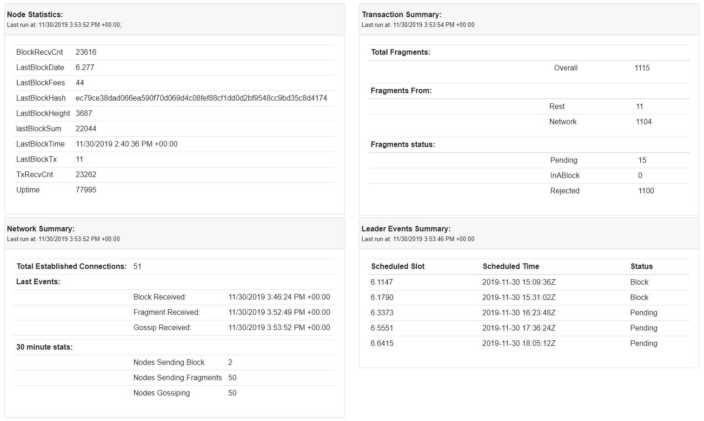
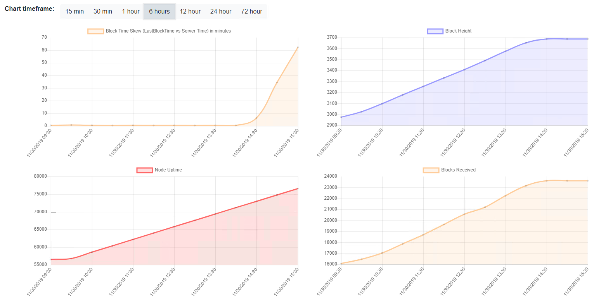
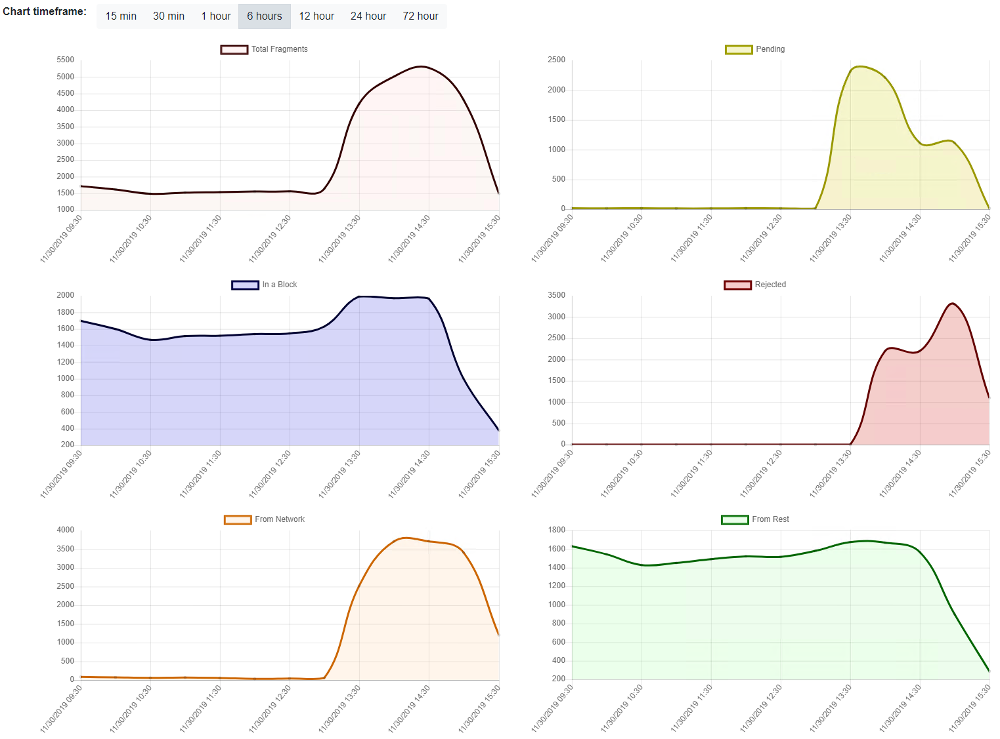
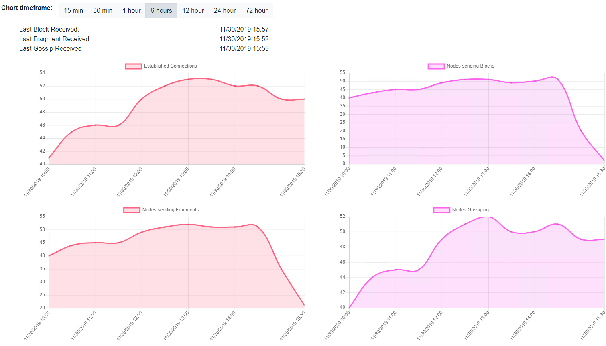
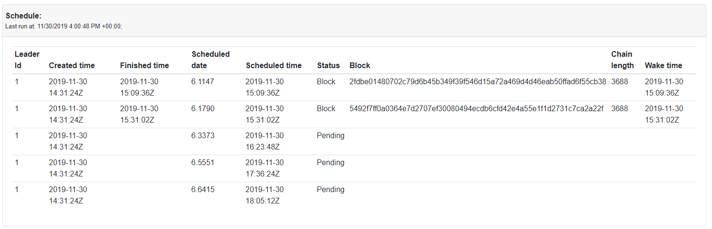

# Kongo
Cardano stakepool monitoring solution

- This is designed to help Stake pool operations monitor their stake pools running on the [Shelley Networked Testsnets](https://iohk.zendesk.com/hc/en-us/categories/360002383814-Shelley-Networked-Testnet)

- This tools is built on [ASP.NET Core 3.0](https://docs.microsoft.com/en-us/aspnet/?view=aspnetcore-3.0#pivot=core) + [Server Side Blazor](https://docs.microsoft.com/en-us/aspnet/core/blazor/hosting-models?view=aspnetcore-3.0)

- [Current releases](https://github.com/stakeyourada/Kongo/releases) are simple xcopy deployable, see [Installation and Use Instructions](./Installation.md) to get started.

- Or build it yourself using [Build Instructions](./BuildInstructions.md)

- Join the [Kongo Discussions](https://t.me/KongoDiscussions) Telegram group

- I am on Telegram @sedwardstx if you have any questions, i am also usually watching @CardanoStakePoolWorkgroup

- Please file bugs or feature requests in https://github.com/stakeyourada/Kongo/issues

# What will you be able to monitor?

**Node Overview**

**Node Statistics**

**Transaction Statistics**

**Network Statistics**

**Leader events**

**+ more coming soon**
